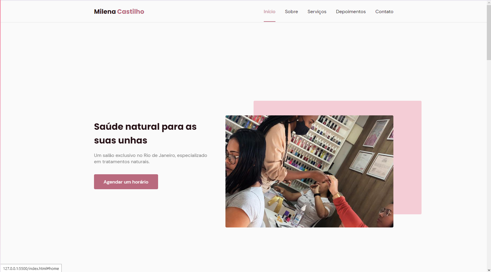
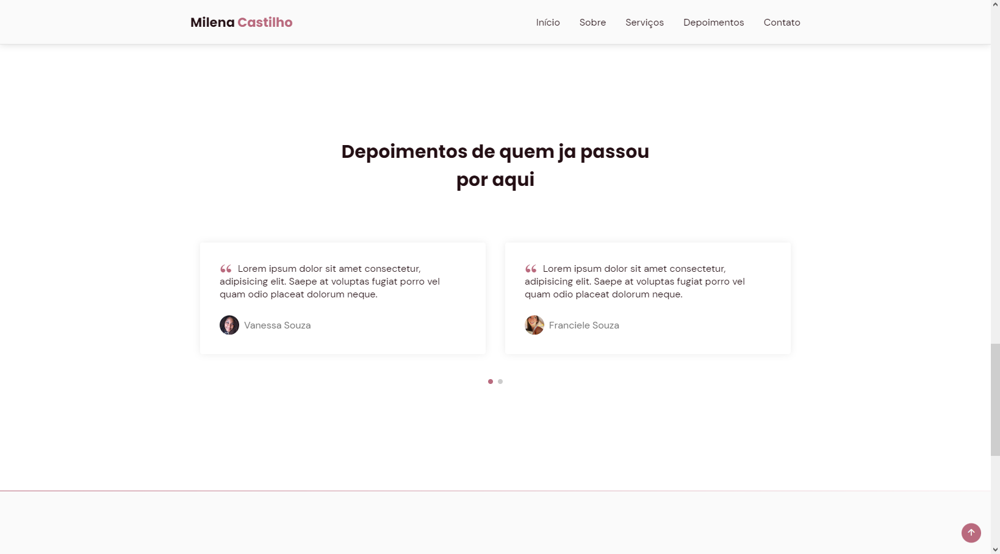
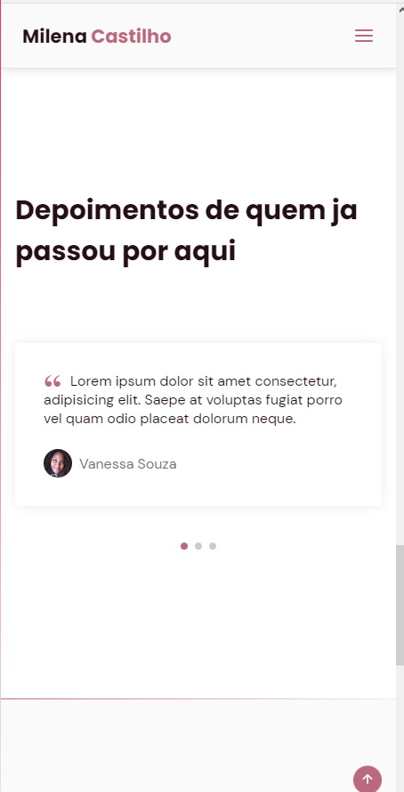
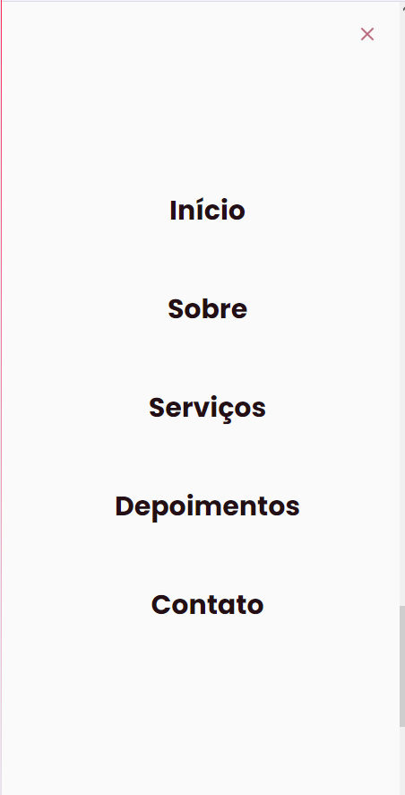

#Landing page
<h3>Landing page de um salão de unha responsiva feito com html, css e javascript </h3>

Usei o ScrollReveal para fazer as animações quando você vai rolando a página pra baixo e as imagens e divs vão aparecendo aos poucos 

Usei o Swiper para fazer os comentários da pagina

link pra teste: https://milena-unhas.vercel.app

 
  
 

